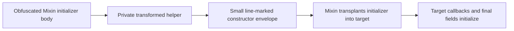

# Obfuscation implementation status — 2026-09-17

## Current verdict

**Candidate 10 passes the completed verification gates and survives the bounded 240-second isolated game smoke. It is NOT certified as issue-free gameplay or approved for deployment.**

The game was stopped by the harness (`terminatedByHarness: true`, exit code 1), not by an independently observed crash. No crash-reports directory was generated and stderr was empty. A surviving process is not proof of responsive rendering. Interactive world/menu/module testing was not completed: window-control approval remained pending through the run and the stale request was cancelled afterward. Temporary desktop bridge disconnections were overcome to retrieve these final results.

Existing uncommitted work was preserved. This work session did not commit or deploy into the installed Modrinth profile, and did not run Codex subagents.

## Artifact identity

All paths in this section are relative to `.codex-test/orbit-20260917/`.

| Artifact | Path | SHA-256 |
|---|---|---|
| Best verified candidate | `desktop-maximal-10.jar` | `be369e07c4f7ef50e9f00015231a49363154bc233ca44d4838338f793609415a` |
| Compiler used | `desktop-compiler-initializer-switch.jar` | `8be54ad6d4a8e6ed738db743d29dd543a1f85ca190562598a464f08808f80b2a` |
| Self-contained profile | `desktop-maximal-10.hocon` | `05ac766c7a153b11a6a3f6b4e7e5216346be39c08426ed8907f24e7698cc83eb` |

Candidate 8 is the preexisting menu-crashing reference. Candidate 9 repairs initializer metadata but is JVM-invalid due to the subsequently repaired terminal-switch issue. The full-constructor stress trial 11 fails safely and must not replace candidate 10.

## New repair: Mixin initializer extraction

The earlier candidate applied all selected Mixins successfully but crashed in GuiButtonRenderer at the main menu. GuiButtonHook's supplier/consumer instance fields remained null in the target. The obfuscated donor constructor still contained their assignments, but the installed Mixin initializer extractor could not use the constructor without the necessary line metadata and transplantable initializer shape.

Audit: 74 annotated Mixin classes, 72 constructors, all 72 missing line contracts before this repair. Two constructors also assign final instance fields.

Implemented `compatibility/MixinInitializerBridge.java`, integrated at output time in `util/MapleJarUtil.java`. The bridge keeps the already-transformed initializer body in a private synthetic Mixin helper and emits a small line-marked constructor envelope. For a supported terminal final assignment, the helper returns the value and the actual final write remains in the constructor. No final modifier is removed and no entire Mixin body/package is exempted.



### Explicit instability markers

- Opt-in flag: `compatibility.experimentalMixinInitializers = true` (default false).
- Runtime diagnostic: `EXPERIMENTAL_MIXIN_INITIALIZERS`.
- Detected unsupported shapes: `UNSTABLE_MIXIN_INITIALIZER`, with output rejected.
- Candidate profiles remain marked UNSTABLE / EXPERIMENTAL.

This adapter assumes the audited field-initializer-only input profile. It is not a general extractor for arbitrary explicit constructor bodies. It rejects multiple/delegating constructors, exception-region constructors, certain effectful/computed superclass prefixes, parameter-dependent helper flow, and unsupported final-write layouts. Detection is not a general proof for every possible input constructor.

`MixinInitializerBridgeTest.java` executes generated fixtures covering numeric scratch flow, idempotence, primitive/category-two returns, superclass forwarding, per-instance final references, and rejection of unsupported cases.

`scripts/VerifyMixinInitializers.java` checks the structural line contract. `scripts/VerifyAppliedInitializerExecution.java` goes further: it loads the actual Mixin-produced targets associated with the candidate hash. Two GuiButton instances passed non-null callback, instance capture, and shadow-field update checks. Two CompiledChunk instances passed initialized, distinct final LinkedList checks without weakening the field's final modifier.

## New repair: terminal zero-pair lookup-switch

Candidate 9 failed Java 8 verification in `com/orbitclient/orbitclient/x/p59/C446.o$730(ZJ)V`. The existing legacy-ASM branch workaround emitted an empty `lookupswitch` at the end of a method. A key-order audit found no unordered keys or malformed table ranges; the terminal empty form itself was rejected.

Changed `compatibility/LegacyAsmBranchGuard.java` to emit one explicit key (zero) with the same destination as the default. This retains the unconditional wide transfer, outlining, invokedynamic sites and transformed body; it does not exempt the failing class.

`scripts/ProbeTerminalSwitch.java` reproduced rejection of the terminal empty form at all four tested alignments on BOTH Java 8u452 and Java 21.0.11. The replacement passed all four on each VM. `LegacyAsmBranchGuardExecutionTest` now covers terminal backward transfers at these alignments. These observations concern the tested terminal shape, not all empty switches.

## Completed candidate 10 gates

Evidence paths below are relative to `.codex-test/orbit-20260917/`.

| Gate | Result | Evidence |
|---|---|---|
| Selected regressions | 85 obfuscator + four runtime-target tests; zero failures/errors/skips | `desktop-initializer-switch-build.log` and isolated build test XML |
| Java 8 class verification | 1,111 checked, 131 generated, zero invalid or inherited dependency failures | `desktop-maximal-10-VerifySkidOutput.log` |
| Mixin constructor audit | 72 constructors, zero missing line contracts, two final stores | `desktop-maximal-10-VerifyMixinInitializers.log` |
| Legacy ASM 5.0.3 rewriting | 4,444 JVM checks over two passes with both seeded and unseeded writers, zero failures | `desktop-maximal-10-VerifyLegacyAsm.log` |
| Actual Mixin application | 68/68 selected real targets applied, out of 69 declared names | `desktop-maximal-10-VerifyAppliedMixins.log` |
| Actual target initializer execution | GuiButton callbacks and CompiledChunk final fields passed | `desktop-maximal-10-VerifyAppliedInitializerExecution.log` |
| Owned classes / modules / reflection | 980 original owned classes; all 124 annotated modules discovered; tested profile keys/configuration lookups preserved | `desktop-maximal-10-VerifyRelease.log` |
| Protobuf | 122 renamed classes, 28 message types, 239 compatibility probes passed | `desktop-maximal-10-VerifyProtos.log` |
| JNA with bundled parent | Five transformed bridge classes, three reflective entrypoints, layouts and real native calls passed | `desktop-maximal-10-VerifySkidNative.log` |
| JNA with legacy 3.4.0 parent | Child-first isolation, Kernel32/User32 queries and layouts passed again | `desktop-maximal-10-VerifySkidNativeLegacy.log` |
| Isolated game smoke | Survived 240 seconds; harness stopped it; no crash-reports directory; stderr empty | `desktop-game-maximal-10/` |

The actual Mixin application test did not select `net.optifine.RandomEntities`. It does not certify OptiFine or the full installed modpack. The legacy-ASM gate itself passed even though its enclosing shell command later returned nonzero during an unrelated cache-directory probe.

## Pass coverage and remaining disabled modes

Candidate 10 retains the broad enabled profile: conditional/exception/switch/range/factory flow; interprocedural transformations, hardening and predicates; wide seeds; numeric and polymorphic string encryption; string/int annotation transformations; signature/return transformations; method dispatch, call obfuscation, merging and outlining; SDK support.

Enabled does not mean every method receives every transformation: ABI, size and structural eligibility still matter. The scope remains `com/orbitclient/orbitclient/**` and `gui/**`; unrelated bundled dependencies are excluded. There are no blanket Mixin/JNA/protobuf body exclusions in this candidate profile.

Still disabled in candidate 10: `constructorObfuscation`, `native`, `fileCrasher`, `tamperProtection`, `ahegao`, and `proprietaryNotice`. `native.enabled=false` refers to the Java-to-native/SkidLLVM pass, not JNA execution. Disabled modes are not automatically classified as inherently impossible or inevitably crashing.

### Full-constructor stress trial 11 — failed, fixable gap

Ran the same broad profile with `constructorObfuscation.enabled = true`, retaining all other enabled passes. Profile: `desktop-constructor-stress-11.hocon`; log: `desktop-constructor-stress-11.log`.

The build exited 1 and rejected publication with:

```text
UNSTABLE_MIXIN_INITIALIZER unsupported shape in
com/orbitclient/orbitclient/m/p45/C368:
constructor exception regions require range-aware extraction;
refusing output rather than dropping initialization
```

The stress profile is explicitly marked UNSTABLE. Candidate 10 was not overwritten. This requires range-aware extraction that preserves exception boundaries and superclass initialization semantics, not a blanket Mixin exemption or disabling the rejection check.

## Hard contracts versus fixable implementation defects

The demonstrated Mixin and branch failures are fixable implementation/encoding problems. They do not require abandoning obfuscation of whole Mixins, JNA bridges, protobuf classes or outlined methods.

External symbol/descriptor, reflection/annotation, native layout/entrypoint and serialization contracts must remain consistent with their consumers. Preserve only the required ABI or adapt the consumers and metadata together; their bodies can remain transformed. The final-field repair deliberately preserves constructor writes rather than moving them into an ordinary method or removing final modifiers.

The current contract report records 2,486 member ABIs, 4,495 fields and 1,952 metadata values while keeping bodies eligible. **60 reflection-discovery sites still require review.** These counts and successful probes do not prove complete dynamic/reflection coverage.

## Remaining release work

Interactive fresh-world/gameplay, rendering, module and configuration save/load testing remains incomplete. Optional/full-profile compatibility and additional random seeds also remain unverified. Full constructor obfuscation needs the extraction work described above. Native compilation, tamper and archive-related modes require their own integration tests rather than optimistic enablement.

The supplied prior session was a pointer to the main review session `rollout-2026-09-17T07-32-44-01a0af5a-e3ce-7bb0-bac7-eee3b70251e4.jsonl`. Earlier protobuf, loader, emitter, runtime-contract and other compatibility patches were already present when this session began; they are not all newly authored work.

The latest compiler regression build used Java 21, the isolated Gradle build init script, offline cached dependencies, and Java 8u452 for target-runtime execution. Candidate 10 and the failed trials are preserved as separate artifacts. Do not infer deployment readiness from build success or a surviving process alone.
